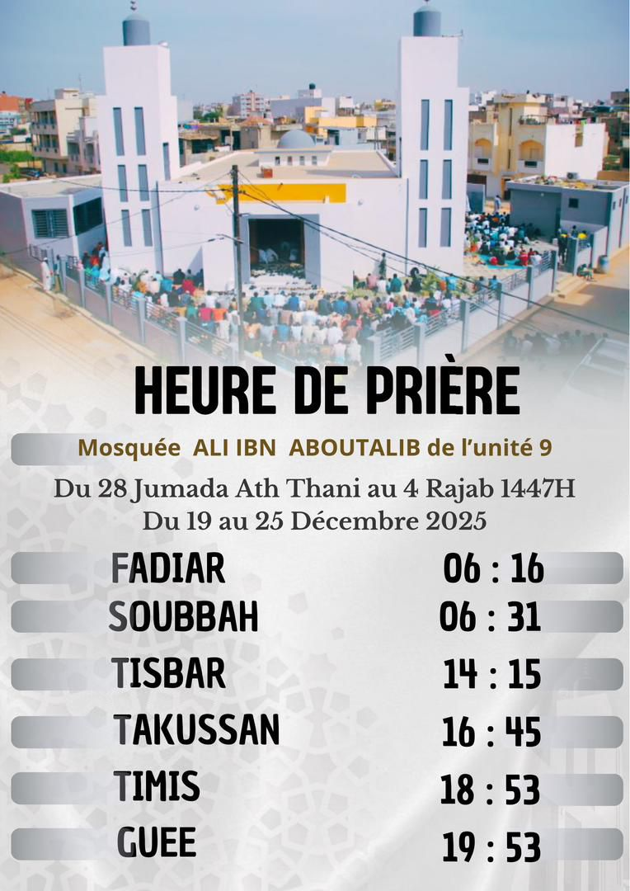

<!DOCTYPE html>
<html lang="fr">
<head>
  <meta charset="UTF-8">
  <title>QR Image</title>
  
</head>

<body>
  <h1>HEURES DE PRIERES</h1>

  

  

    Voici le texte qui s’affiche sous l’image. 
    BIENVENUE DANS LA PAGE ALI IBN ABOU TALIB
  

</body>
</html>
